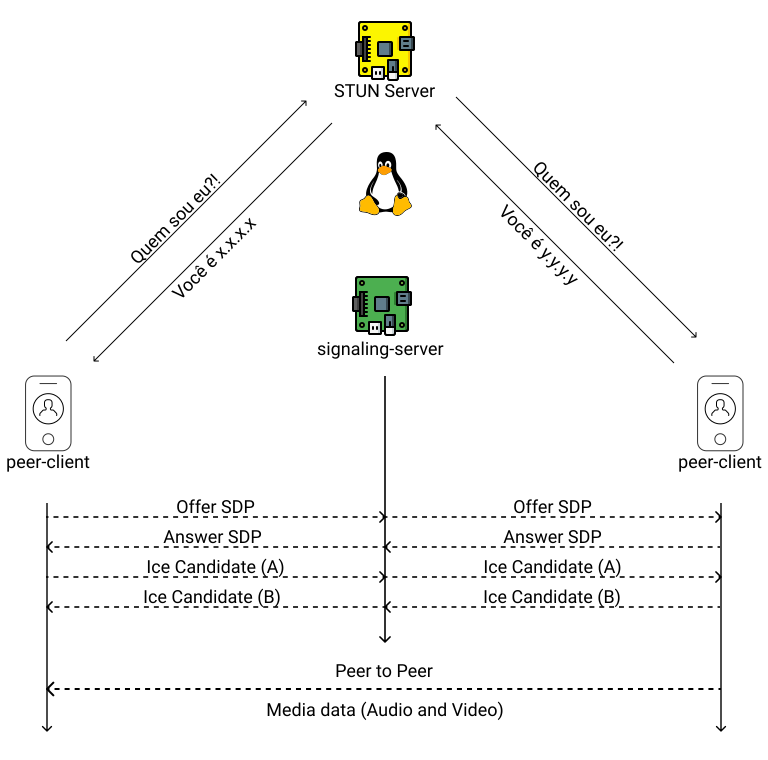
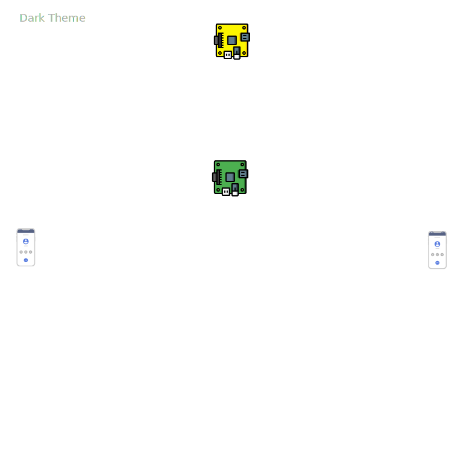

# Fundação da Livre Comunicação

## Como funciona
Com esta tecnologia é possível conversar usando conexão ponto a ponto *(p2p)*, não desde seu inicio como alguns pensam, pois nossa infra na rede *WAN* é complexa e um ponto precisa econtrar o melhor caminho para chegar e além disso você estará se conectando a um dispositivo usando um endereço IP numa rede *LAN*. Para criar esta roda são necessários o STUN Server, que ajuda encontrar este caminho e também o Signaling. Ambos são tecnologias já existentes, o Signaling é um conceito e pode ser implementado da forma desejada, desde que cumpra sua missão, que é informar a outra ponta sobre uma ação que será tomada.

O fato é que a comunicação própriamente dita, a conversa em áudio ou vídeo, é trafegada diretamente de um ponto ao outro diretamente após a ligação ter sido estabelecida com a ajuda dos 2 carinhas citados acima, esta comunicação é criptografada por padrão, então é segura. Como é encontrado o melhor caminho, após ligação feita ela também é mais rápida que o normal, pois percorre um caminho menor sem desvios. : )

Basicamente funciona como as imagens abaixo apresentam. 
### Para temas claros

### Para temas escuros
*Thanks  [@O Geovani](https://github.com/geovanisouza92)*

---

 - [Código de Conduta](CODE_OF_CONDUCT.md).
 - [Como contribuir](CONTRIBUTING.md) com a Livre Comunicação.

